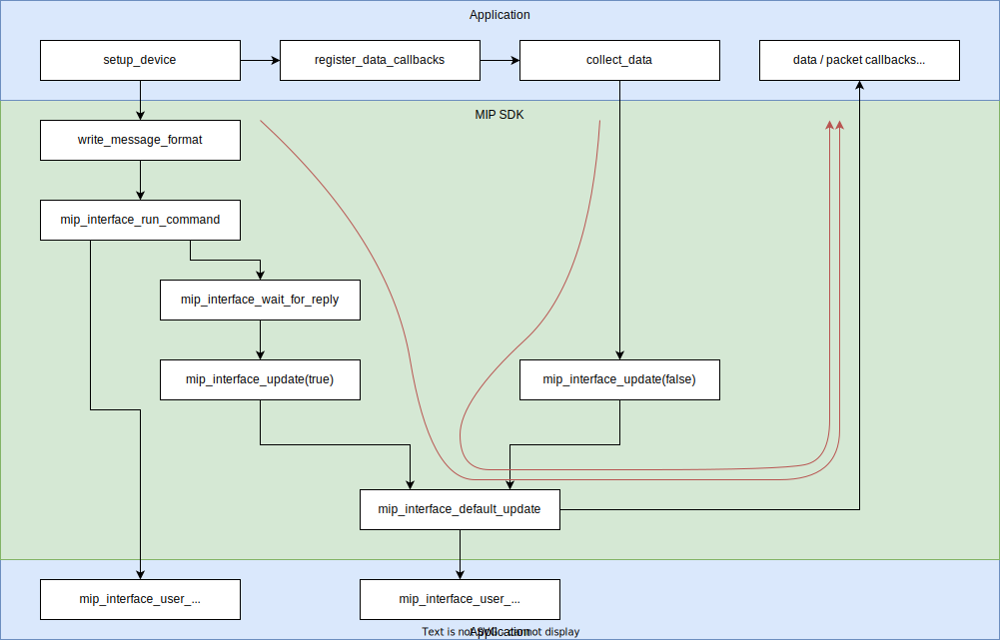
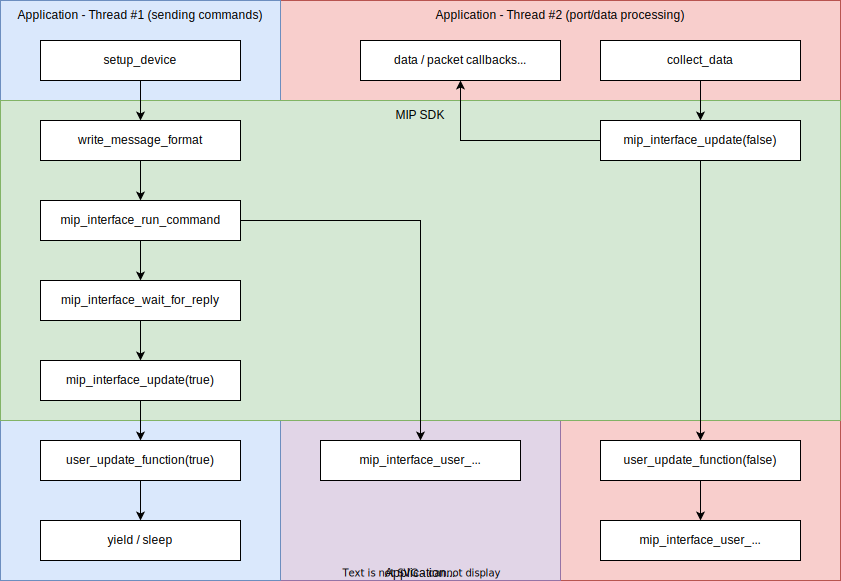

Mip Interface  {#mip_interface_interface}
=============

Application Interface
---------------------

The MIP interface is a high-level abstraction of a physical device which
communicates using the MIP protocol. It provides both data callbacks and
command functions for controlling and configuring the device:

When an application calls one of the command functions, the MIP interface
creates a packet, sends it to the device, and waits for a reply. When the
reply is received, the command function returns the reply code to the
application. If no reply is received, or if an error occurs, the function
will return a status code.

Sending and receiving to or from the device occurs via two functions:
* mip::Interface::sendToDevice() or mip_interface_send_to_device() for transmission and
* mip::Interface::recvFromDevice() or mip_interface_recv_from_device() for reception.

Each of these has a corresponding callback to the application. The
application is expected to implement the required behavior for each as
described below. Additionally, there is an @ref update "update function",
which handles periodic tasks such as command timeouts and streaming data
collection. An application may optionally override the update callback.

* [mip_send_callback](@ref mip::C::mip_send_callback)
* [mip_recv_callback](@ref mip::C::mip_recv_callback)
* [mip_update_callback](@ref mip::C::mip_update_callback)

An application obtains sensor data via the [dispatch subsystem](@ref mip_dispatch). There are 3 ways to do so:
* Packet callbacks, which call a function when a packet matching the MIP descriptor set is received,
* Field callbacks, which call a function when a MIP field matching the descriptor set and field descriptor is called,
  and
* Data pointers, which point to a data structure in memory and update it when the associated data is received.

Sending Commands  {#mip_commands}
----------------

Typically an application will configure the device, initialize some
settings, and start streaming. To do so, it must send commands. In many
cases, applications will call a single function for each needed command
(e.g. @ref MipCommands_c / @ref MipCommands_cpp).
These functions take the command parameters as arguments, send the packet,
wait for the reply, and return a result code. Additionally some commands can
report back responses from the device.

The command functions are blocking, that is, they halt execution until the
device responds or the command times out.

Note that since MIP data is received serially and is not buffered, data may
be received and processed while waiting for command responses. It is
recommended (but not required) to set the device to idle during configuration.

The Dispatch System    {#mip_dispatch}
-------------------

Because of the limited resources on embedded platforms, the MIP SDK will not
buffer received data, and instead requires the application to process data
as it arrives. The MIP interface will dispatch callbacks to the application
when the requested data is received.

The MIP interface can dispatch data in 3 ways:
* Packet callbacks, which call a function with a mip packet,
* Field callbacks, which call a function with a single mip field, and
* Data pointers, which are updated with data from a single mip field.

With the first two options, the callback function will receive a handle to
the MIP interface, the associated MIP packet or field, and the reception
timestamp.

An application must register callbacks with the system during
initialization. Each method requires a pointer and the MIP descriptor
associated with the data of interest. There is no limit on the number
of registered dispatchers, though performance may be affected by using
too many. Multiple dispatchers may be registered to the same data.

### Packet callbacks

~~~~~~~~{.cpp}
 void packet_callback(void* userdata, const mip::PacketView& packet, Timestamp parseTime)
~~~~~~~~

Packet callbacks are invoked when a packet is received which matches the
registered descriptor set. The descriptor set may also be a wildcard,
allowing the application to process any type of packet.

An application can register a packet callback to occur either before or
after the field callbacks for the data in the same packet. For example,
to print a summary of the packet before displaying information about each
field, an application would set the callback to occur first. Usually
applications will set a packet callback to occur last, so that they can
determine if all of the fields have been processed.

### Field callbacks

~~~~~~~~{.cpp}
 void field_callback(void* userdata, const mip::FieldView& field, Timestamp parseTime)
~~~~~~~~

Similar to packet callbacks, field callbacks are invoked when a MIP
field is received which matches the specified descriptor set and
field descriptor. Either descriptor may be a wildcard.

### Data pointers

Data pointer dispatchers can alleviate a lot of boilerplate code having to
do with deserializing a MIP field and storing it somewhere. An application
can register a pointer one of the MIP data structures, along with the
associated descriptors, and have it automatically updated. The descriptors
cannot be wildcards because the type of the data structure is fixed.

### Data callbacks

~~~~~~~~{.cpp}
 void data_callback(void* userdata, const mip::data_sensor::ScaledAccel& packet, Timestamp parseTime)
~~~~~~~~

Thanks to the power of templates, one additional dispatch mechanism is
available for C++ applications. A data callback is similar to a field
callback except that instead of getting the raw MIP field data, the function
is passed the fully-deserialized data structure.

Typically an application will register a series of data or field callbacks
and write the data to some kind of data structure. Because the order of
these callbacks depends on the device configuration, it can be difficult
to know which fields belong together in one sample. The solution is to use
a packet callback after all of the fields are received. In the case of
wraparound "overflow" MIP packets (see the MIP documentation), packets
containing a shared timestamp or event source field at the beginning can
be used to group data together.

The Update Function  {#update}
-------------------

The application should call mip_interface_update() periodically to process
data sent by the device. This update function will call
mip_interface_recv_from_device() to parse packets. When a data packet is
received, the list of packet and data callbacks is checked, and any
matching callbacks are invoked. The update function should be called at
a high enough rate to avoid overflowing the connection buffers. The
precision of the reception timestamp is dependent on the update rate.

The command functions in @ref MipCommands_c / @ref MipCommands_cpp (e.g. mip::C::mip_write_message_format() / mip::writeMessageFormat())
will block execution until the command completes. Either the device will
respond with an ack/nack code, or the command will time out. During this
time, the system must be able to receive data from the device in order for
command replies to be detected. This occurs via the mip_interface_update()
function as well.

### Single-threaded applications

For single-threaded applications, data can be read from the port directly
from within the command function. While the command is waiting (status code
MIP_STATUS_WAITING / CmdResult::STATUS_WAITING), repeated calls to the
update function will be made. By default, the update function calls
mip_interface_recv_from_device(). Because the function is called from
within a loop, it should sleep for a short time to wait for data if none
has been received yet. Doing so prevents excessive CPU usage and lowers
power consumption.

The following diagram shows the typical control flow for a single-threaded
application. First, the device is configured by setting the message format.
Execution flows down into the command processing functions until
mip_interface_wait_for_reply() is called. This will repeatedly call
mip_interface_update() to pump packets from the device through the system,
until either an ack/nack is received or the command times out.
Once the device acknowledges the command, control is returned to the
application which then registers some data or packet callbacks. It finally
goes into a loop in collect_data(). Inside this loop, the update function
is called to process data packets.

Notice that the same update function is called from both the command
function and the data collection loop. If any data packets are received
while waiting for a command reply, associated callbacks may be executed.
This is why this example application registers its callbacks after the
format is configured properly.

### Multi-threaded applications

For some applications, it may be desirable to run all of the data collection
from a separate thread. In this case, the command functions must not
call the update function as that would cause a race condition between the
command thread and the data thread. Instead, the command thread should
simply sleep or yield and let the data thread process the ack/nack packet.

To allow this behavior, the update function takes a boolean parameter which
is true when waiting on a command and false when processing data. The
default update function, mip_interface_default_update(), ignores this flag,
but applications may override it via mip_interface_set_update_function(). In
this case, a wrapper function can be created which implements the above
behavior:
~~~~~~~~{.c}
 bool user_update_function(struct mip_device* device, bool blocking)
 {
     // If called from the data thread, do the normal processing.
     if( !blocking )
         return mip_interface_default_update(device, blocking);

     // Otherwise, sleep and let the data thread process the reply.
     std::this_thread::sleep_for(std::chrono::milliseconds(10));
     return true;
 }

 mip_interface_set_update_function(device, &user_update_function);
~~~~~~~~

See the threading demo for an example application.

### Other thread-safety concerns

* Data transmission to the device (but not sending commands) is thread-safe
  within the MIP SDK. If multiple threads will send to the device, the
  application should ensure that the device interface is properly protected.

* It is up to the application to ensure that sending and receiving from
  separate threads is safe. This is true for the built-in serial and TCP
  connections on most operating systems.

### Using a custom update function for other purposes

An alternate update function may be used for single-threaded applications, too:
* To update a progress bar while waiting for commands to complete
* To process data from other devices
* To avoid blocking inside mip_interface_recv_from_device() when called from a data processing loop.
* To push data through the system in a different way (e.g. without using mip_interface_recv_from_device())

Data may be pushed into the system by calling any of these functions:
* mip_interface_default_update() - this is the default behavior.
* mip_interface_receive_bytes() - process bytes, given a buffer.
* mip_interface_receive_packet() - process pre-parsed packets.
* mip_interface_process_unparsed_packets() - continue parsing buffered data.
